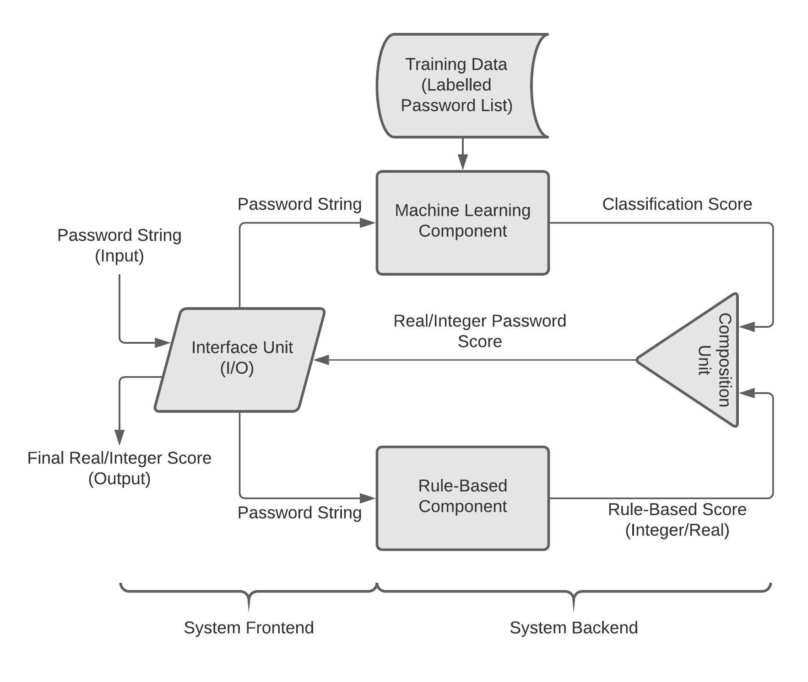

# HPSAT: Hybrid Password Strength Analysis Tool

This tool can be used to estimate strength of a given password using Machine Learning classification algorithms and Rule-Based pattern tests.
The primary components of this tools are as follows:
- **Machine Learning Component:** It consists of prediction models created by training various classification algorithms e.g., Logistic Regression, KNN, SVM, NaïveBayes, Decision Tree etc. on a specific data set. The data-sets I am using are **leaked** password lists from **hashkiller**, **000webhost** and **rockyou** etc. To label these passwords in the data-set by current standards, I have used a tool called **PARS(Password Analysis and Research System)** developed at **Georgia Tech University**.

- **Rule Based Component:** It is a light-weight unit that contains a collection of tests catered to detecting password's vulnerability to specialized attacks like **Mask Attacks**, **Dictionary Attacks**, **Combinator attacks** etc. The password string is evaluated by these tests and then assigned a real/integer score based on the number and type of tests in which it
gets the desired results.

- **Composition/Integration Unit:** It takes the classification score of a given password allocated by the Machine Learning unit and the integer/real score of the Rule Based unit as its inputs. It combines these scores using a specific strategy to generate the **final real/integer normalised score** assigned to the given password.

<br>
<p align="center">
  
</p>

To properly understand the inner workings of this tool, go through the [Project Documentation](https://github.com/AQUIF11/HPSAT/tree/main/project_docs/docs).

## Results

Accuracy against two traditional standard password strength analysis tools:

- [NordPass](https://nordpass.com/secure-password/): Upon analysis, HPSAT had an accuracy of about **92%** when compared against NordPass.
<br>
<p align="center">
  
</p>

- [LastPass](https://lastpass.com/howsecure.php): Upon analysis, HPSAT had an accuracy of about **89%** when compared against LastPass.
<br>
<p align="center">
  
</p>

## Prerequisities

Before running any of the scripts in this framework, ensure you have the necessary dependencies installed. Install them using the following command:

```bash
pip install -r requirements.txt
```

## Usage

Run the scripts using the following command format:

1. Evaluate your password with **Rule-Based Component**:
    ```bash
    python rule_based_password_strength.py
    ```

    ### Example

    ```bash
    python rule_based_password_strength.py
    Enter password: Abc@123
    The password 'Abc@123' got the score 58 and readableScore OK
    ```

2. Evaluate your password with **Machine Learning Component**:
    ```bash
    python ml_password_strength.py
    ```

    ### Example

    ```bash
    python ml_password_strength.py
    Enter password: Abc@123
    Machine Learning Component Score (Min=1, Max=3): 2
    ```

3. Evaluate your password with **HPSAT**:
    ```bash
    python password_strength.py
    ```

    ### Example

    ```bash
    python password_strength.py 
    Enter password: Abc@123
    Ml Password Classification Score: 2
    Rule Based Password Score: 58

    Credits:
    Length Score: 28 (0)
    Lower And Upper Case Character Score: 22 (3, 2)
    Digit Score: 12 (3)
    Special Character Score: 6 (2)
    Middle Score: 6 (3)
    Extra Score: 0 (0)

    Penalties
    Letters Only Score: 0 (0)
    Numbers Only Score: 0 (0)
    Repeating Chars Score: 0 (0)
    Consecutive Case Score: -6 (1, 0, 1)
    Sequential Letters Score: -2 (1)
    Sequential Numbers Score: -8 (1)
    Dictionary Words Score: 0 (0)


    Final Score: 59.000000
    Password Complexity: OK
    ```

## Output

Depending upon the component used, the script outputs a detailed analysis on the console. Each component is self-contained for modular use.